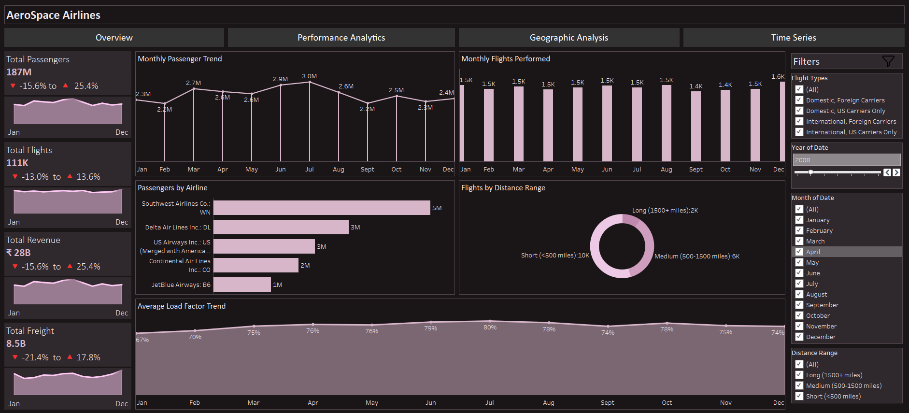
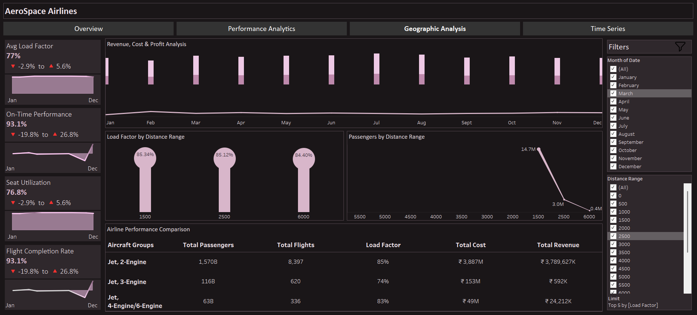
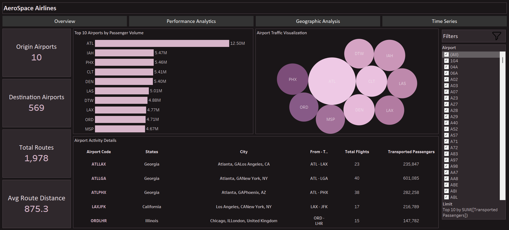
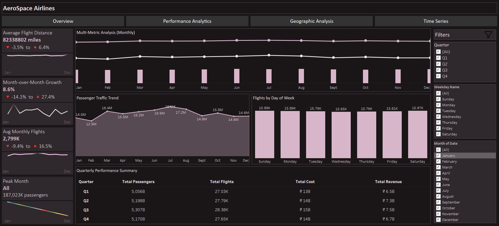

# ✈️ AeroSpace Airlines Dashboard
**Advanced Tableau Project | Multi-Page Analytical Suite**

## 📌 Overview
This project is an end-to-end Airline Analytics solution built in Tableau, designed to help business stakeholders make data-driven decisions across operations, performance, geography, and time.

The dashboard highlights passenger trends, operational performance, airport activity, route insights, and overall airline efficiency using advanced KPIs, parameter-driven controls, interactive navigation, and storytelling-focused design.

---

## ⭐ STAR Method Breakdown

### **S — Situation** 
Airline operational and passenger data was fragmented, making it difficult for stakeholders to understand route performance, airport activity, seasonal trends, and overall operational efficiency.

### **T — Task**
Build a unified, interactive Tableau analytics suite that delivers:
- Executive-level KPIs  
- Route, airport, performance, and time-series analysis  
- Global filtering across dashboards  
- Professional UI, smooth interaction, and clear data storytelling  

### **A — Action**
Created a **4-dashboard analytical system** using advanced Tableau features, custom calculations, and dynamic navigation.

### **R — Result**
Delivered an **executive-ready analytics suite** that enables:  
- Faster strategic decisions  
- Deeper insights into routes, airports, geography & performance  
- Clear seasonal and operational trends  
- End-to-end exploration with global filters  

---

## 📊 Tools & Tech Stack
- Tableau Desktop 2023+
- Excel/CSV Data Source
- Tableau Data Model & Custom Calculations

---

## 🔗 Live Preview
([Live Dashboard](https://public.tableau.com/app/profile/shadan.sarfaraz/viz/AeroSpaceAirlines/Overview?publish=yes))

---

## 📊 Dashboards

### 1️⃣ Overview Dashboard
Provides a high-level operational snapshot.
 

### 2️⃣ Performance Analysis Dashboard
Focuses on operational efficiency and service quality.

### 3️⃣ Geographical Analytics Dashboard
Highlights airport-level and route-level activity.
 

### 4️⃣ Time Series Dashboard
Designed for temporal analysis and forecasting.
 

---

## 🔧 Global Filters  
Applied to all dashboards:  
**Year, Quarter, Month, Weekday, Flight Type, Airline, Airport, Distance Range**

These filters are configured as **Apply to Worksheets → All Using This Data Source**, ensuring that:
✔ All charts update dynamically  
✔ KPIs recalculate instantly  
✔ Cross-dashboard consistency is maintained  
✔ Users can slice & explore data at any level  

--- 

## 🧮 Key Calculated Fields
- % Change vs Last Period
- On-Time Performance
- Seat Utilization
- Flight Completion Rate
- Revenue
- Cost
- Profit
- Distance Range

---

## 🎨 Features & Techniques Used
- Global filters applied to all visuals
- Multi-dashboard navigation buttons
- Parameter controls for revenue & cost modeling
- Dynamic titles and KPI indicators
- Table calculations (LOOKUP, WINDOW_MAX, RUNNING_SUM)
- YoY & MoM analytics
- Dual-axis lines

---

## 🏁 Conclusion
This dashboard transforms complex airline data into clear, actionable insights through advanced KPIs, interactive filters, and multi-page analytics. It enables quick understanding of performance, trends, routes, and geographic patterns, helping stakeholders make smarter, data-driven decisions.

---

## 👤 Author
**Shadan Tech**   
_Data Analyst_

🔗 [LinkedIn Profile](http://www.linkedin.com/in/shadantech)  
🔗 [Tableau Public Profile](https://public.tableau.com/app/profile/shadan.sarfaraz/vizzes)
🔗 [Newsletter](https://shadantech.substack.com/)

---

## ⭐ Show Your Support
If you found this project insightful, give it a **⭐ Star** on GitHub — it helps others discover it too!  
Connect on **LinkedIn** for more Power BI, Tableau, and Data Analytics projects.